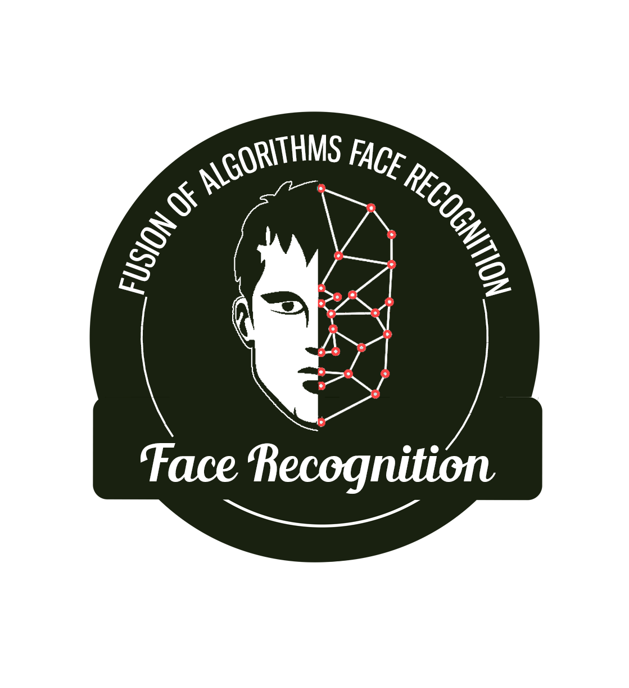

# **Fusion of algorithms for face recognition**

### Realised By : Khalil Bouguerra 

---

#### For a full version of the report and  better graphics visulisation please open this notebook in [google colab environment [Fusion of algorithms for face recognition](https://colab.research.google.com/drive/1obJMHbaiCY82qiV152AzK2OQ4V3ee3ah?usp=sharing)
---
 

The increasingly ubiquitous presence of biometric solutions and face recognition in particular in everyday life requires their adaptation for practical scenario. In the presence of several possible solutions, and if global decisions are to be made, each such single solution can be far less efficient than tailoring them to the complexity of an image.

In this challenge, the goal is to build a fusion of algorithms in order to construct the best suited solution for comparison of a pair of images. This fusion will be driven by qualities computed on each image.

Comparing of two images is done in two steps.

*  1st, a vector of features is computed for each image.
*  2nd, a simple function produces a vector of scores for a pair of images. 

 The goal is to create a function that will compare a pair of images based on the information mentioned above, and decide whether two images belong to the same person.
